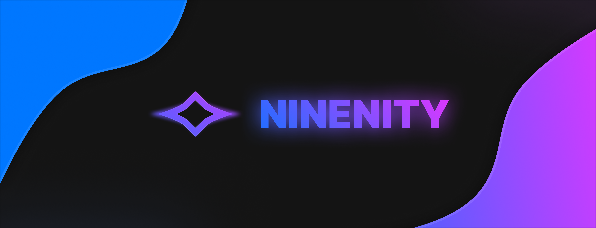

  

  <h1>Sua comunidade merece mais que canais genéricos.</h1>

  

    <strong>Servidores profissionais, bots personalizados e ferramentas próprias para comunidades no Discord.</strong>
  

  

    
    
  

## Sobre a Ninenity

A **Ninenity** ajuda comunidades a crescerem através de servidores bem estruturados, bots personalizados sob demanda e ferramentas próprias para facilitar a gestão e o engajamento.

Mais do que configurar canais ou desenvolver comandos, criamos ambientes funcionais, organizados e preparados para acompanhar a evolução de cada comunidade.

## Nossas soluções

<table>
  <tr>
    <td width="33%" valign="top">
      <h3>🤖 Bots personalizados</h3>
      

        Automatizações e funcionalidades desenvolvidas para as necessidades da sua comunidade.
      

      <ul>
        <li>Comandos e fluxos personalizados;</li>
        <li>Moderação, economia e automações;</li>
        <li>Sistemas exclusivos para o seu projeto;</li>
        <li>Integrações e soluções sob demanda.</li>
      </ul>
      <a href="https://discord.gg/sdtvuVEcp9">Solicitar orçamento →</a>
    </td>
    <td width="33%" valign="top">
      <h3>🏗️ Servidores profissionais</h3>
      

        Estruturas planejadas para tornar conversas, eventos e interações mais organizados.
      

      <ul>
        <li>Categorias e canais bem estruturados;</li>
        <li>Cargos e permissões configurados;</li>
        <li>Organização visual e funcional;</li>
        <li>Reformulação de servidores existentes.</li>
      </ul>
      <a href="https://discord.gg/sdtvuVEcp9">Solicitar orçamento →</a>
    </td>
    <td width="33%" valign="top">
      <h3>⚙️ Ferramentas próprias</h3>
      

        Soluções desenvolvidas pela Ninenity para apoiar administração, segurança e crescimento.
      

      <ul>
        <li>Ferramentas para gestão de comunidades;</li>
        <li>Recursos de segurança e moderação;</li>
        <li>Sistemas de métricas e acompanhamento;</li>
        <li>Projetos próprios em evolução.</li>
      </ul>
      <a href="https://ninenity.com/projects/">Conheça nossos projetos →</a>
    </td>
  </tr>
</table>

## Uma comunidade mais organizada

Cada servidor possui objetivos e públicos diferentes. Por isso, pensamos na experiência dos membros e na rotina dos administradores em cada etapa do projeto.

| Estrutura organizada                                                   | Automação inteligente                                                           | Comunidades únicas                                                            |
| ---------------------------------------------------------------------- | ------------------------------------------------------------------------------- | ----------------------------------------------------------------------------- |
| Servidores planejados para facilitar conversas, eventos e engajamento. | Bots desenvolvidos para reduzir tarefas e melhorar a experiência da comunidade. | Uma organização pensada para o objetivo, o tema e o público de cada servidor. |

## Métricas para comunidades

Nossos bots podem contar com sistemas de métricas para ajudar administradores a acompanhar a atividade, o crescimento e o comportamento da comunidade.

Com informações reunidas em um só lugar, fica mais fácil entender o que está funcionando, identificar oportunidades e tomar decisões melhores para o servidor.

## Nosso ecossistema

A Ninenity também desenvolve tecnologias próprias para melhorar a criação de soluções para comunidades. O **Neutrun** é a nossa base para bots, construída com TypeScript, Discord.js e Express.js, permitindo criar experiências personalizadas e de alta qualidade.

## Por que escolher a Ninenity?

- **Soluções sob medida:** cada projeto parte das necessidades reais da sua comunidade.
- **Organização e praticidade:** estruturas claras, funcionais e fáceis de administrar.
- **Experiência dos membros:** pensamos na jornada de quem participa do servidor.
- **Preparação para crescer:** uma base capaz de acompanhar a evolução do projeto.
- **Atenção à identidade:** respeitamos o objetivo, o tema e o público de cada comunidade.

## Já possui uma comunidade?

Também ajudamos comunidades que já estão em funcionamento. Analisamos a estrutura atual, reorganizamos canais, revisamos cargos e permissões, configuramos automações e implementamos melhorias para tornar o ambiente mais funcional e agradável.

  <a href="https://discord.gg/sdtvuVEcp9"><strong>Conhecer a Ninenity</strong></a>

## Vamos construir algo único?

Conte para a Ninenity o que você deseja criar. Nossa equipe entende as necessidades da sua comunidade e encontra uma solução alinhada ao seu objetivo.

  <a href="https://ninenity.com"><strong>Visitar ninenity.com</strong></a>
  &nbsp;&nbsp;•&nbsp;&nbsp;
  <a href="https://ninenity.com/projects/"><strong>Conhecer nossos projetos</strong></a>
  &nbsp;&nbsp;•&nbsp;&nbsp;
  <a href="mailto:contact@ninenity.com"><strong>Enviar um e-mail</strong></a>

  Organização, automação e identidade para comunidades que querem crescer.

